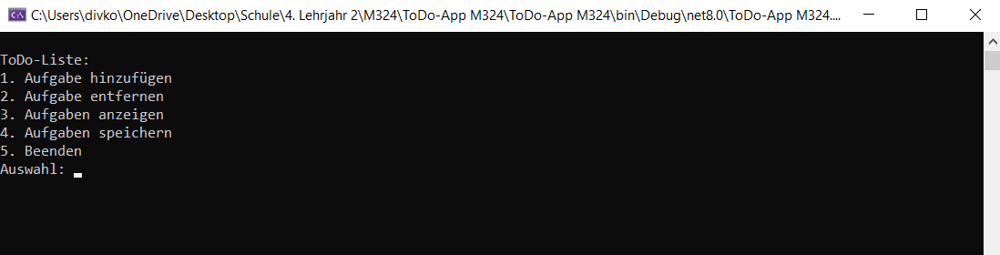

# ToDo-App

Diese Anwendung ist eine einfache ToDo-Liste, die in C# geschrieben wurde. Sie ermöglicht es, Aufgaben hinzuzufügen, zu entfernen, anzuzeigen und zu speichern. Die Aufgaben werden in einer CSV-Datei gespeichert, sodass sie auch nach dem Beenden des Programms erhalten bleiben.



## Funktionen
- **Aufgabe hinzufügen**: Neue Aufgaben können zur Liste hinzugefügt werden.
- **Aufgabe entfernen**: Bestehende Aufgaben lassen sich anhand ihrer Nummer löschen.
- **Aufgaben anzeigen**: Die aktuelle ToDo-Liste wird in der Konsole ausgegeben.
- **Aufgaben speichern**: Alle Aufgaben werden in einer CSV-Datei gespeichert, sodass sie beim nächsten Start wieder verfügbar sind.

## Dateispeicherung
Die Aufgaben werden in der Datei `todo_list.csv` gespeichert. Falls die Datei existiert, werden beim Start des Programms die bestehenden Aufgaben geladen.

## Beispiel
```sh
ToDo-Liste:
1. Aufgabe hinzufügen
2. Aufgabe entfernen
3. Aufgaben anzeigen
4. Aufgaben speichern
5. Beenden
Auswahl: 1
Neue Aufgabe: Hausaufgaben machen
Aufgabe hinzugefügt!
```
